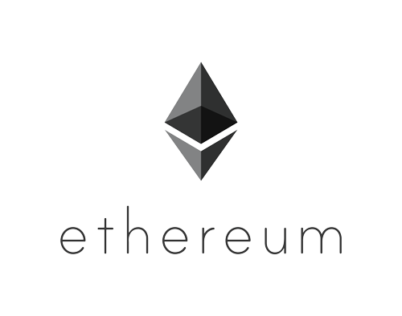

# KLY-EVM implementation

This is the separate repository for KLY-EVM - mutable, CIIP-X improved, post-quantum, liked-by-Gigachad VM

# How can use it?

KLYNTAR symbiotes can load it as a dependency, use in their workflows, fork it and use to improve KLY ecosystem

# Is there any additional tools for it

Sure! We also have a JSON-RPC2.0 implementation <a href="https://github.com/KLYN74R/KlyntarEVMJsonRPC">here</a>(or load npm package <a href="https://www.npmjs.com/package/@klyntar/klyntarevmjsonrpc">here</a>) mostly compatible with PoS & BFT based symbiotes(there is no support of methods about hashrate and so on). You can also fork it and improve, add custom RPC and so on.